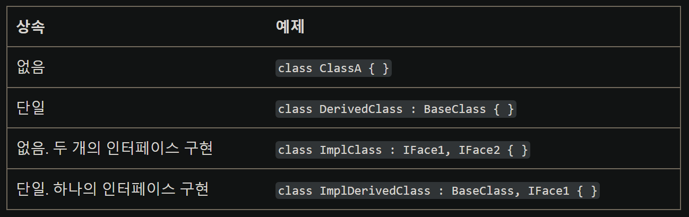
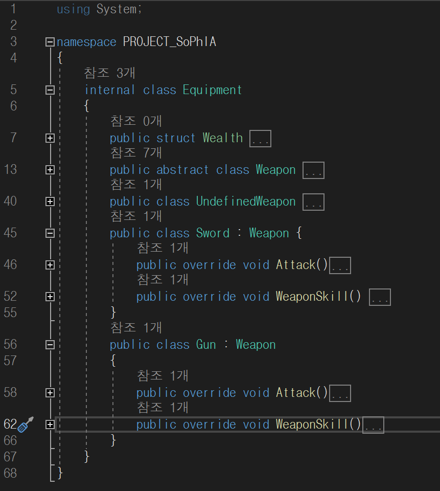

---
ebook:
  theme: github-light.css
  title: 객체지향
  authors: Escatrgot
  disable-font-rescaling: true
  margin: [0.1, 0.1, 0.1, 0.1]
---

<style>
    h3.quest { font-weight: bold; border: 3px solid; color: #A0F !important;}
    .quest { font-weight: bold; color: #A5F !important;}
    h2 { border-top: 12px solid #D40; border-left: 5px solid #D40; border-right: 5px solid #D40; background-color: #D40; color: #FFF !important; font-weight: bold;}

    h3 { border-top: 12px solid #F90; border: 5px solid #F90; background-color: #F90; color: #FFF !important;}
</style>

## 📕 3. 객체지향 상속

---
### 📄 1. 상속

#### 1). 상속(inheritance)?
|상속이란|그림|
|---|---|
|기본 클래스의 **멤버와 메소드를 물려받아**<br> 새로운 클래스(**파생 클래스**) 를 생성할 수 있다.<br>*단, 기본 클래스의 생성자와 종료자는 제외.*||

**ⓐ 상속의 대상이 되는놈은 2가지 있다. : *1. 클래스* & *2. 인터페이스***
* 즉 클래스만 상속하는게 아니라 인터페이스도 상속이 된다.


**ⓑ C#에서는 *단일 상속만 허용*됩니다.**
* 클래스 & 추상클래스 : 하나만.
* 인터페이스 : 여려개.

* 예시
    ```cs
    1. 부모클래스는 없거나, 오직 단 하나만 상속 가능
    2. 인터페이스는 여려개도 상속이 된다.

    Class Foo : _부모클래스_ (또는) _인터페이스1_, _인터페이스2_ , ... , _인터페이스N_ {

    }
    ```

#### 2). 상속의 의의

1. 기존에 작성된 클래스를 **재활용**.
2. 기존 클래스를 **확장**
3. 기존 클래스를 **재정의** 

---

### 📄 3. 메소드 오버라이딩(method overriding)

#### 1). 특징
**클래스의 메소드를 재정의하고 싶을때 사용하는 문법**
```cs
Class 검 {
    int 공격력; int 공속;
    void Attack(){ 대충 3번 치키}
}
Class 광검 : 검 {
    ...
    override void Attack() {빛을 내며 3번치기 그리고 마지막 추가타}
    ...
}
```

* 기본 클래스에서 **이미 정의된 메소드**를 
파생 클래스에서 **다른 로직으로 메소드를 다시 정의**하는 것이라고 할 수 있습니다.

* private 멤버를 제외한 모든 메소드를 상속받습니다.
이렇게 상속받은 메소드는 그대로 사용해도 되고, 필요한 동작을 위해 재정의하여 사용할 수도 있음.

<h4 class="quest">2). 궁금한데 아니 그럼 멤버변수는 오버라이트 못하나? 😳</h4>

---

### 📄 4. 다형성

http://www.tcpschool.com/java/java_polymorphism_concept

#### 1) 특징

**"부모클래스 타입"의 참조 변수로 "자식클래스 타입"의 인스턴스를 참조할 수 있다.**
그럼 부모클래스는 자식클래스 전용 멤버에 접근할수 있나?? : ❌

* 부모클래스 타입 변수는 오직 부모클래스 멤버만 접근할 수 있다.
* 그말인 즉슨 **비록 자식이 가지고 있다 하더라고 부모에 구현이 안되어 있으면** 쓸수가 없다는 말이다.

|Sophia App.cs|Sophia Equipment.cs|
|---|---|
|||


---

### 📄 5. 추상 클래스

#### 1). 추상 클래스(abstract class)?
**ⓐ 하나 이상의 추상 메소드를 포함하는 클래스를**
1. 클래스는 클래스인데.. 
  추상클래스 그 자체로는 인스턴스를 만들 수 없는 미완성 클래스다.. 😶
     * 들어있는 추상 매서드도 미완성이다.(구현부가 없다)

1. **오직 상속용으로, 파생클래스 만 쓸수 있는 미완성 클래스**
     * 오버라이딩하고 나서야 비로소 자식 클래스의 인스턴스를 생성할 수 있게 된다..

2. 추상 클래스는 추상 메소드를 포함하고 있다는 점을 제외하면
일반 클래스와 모든 점이 같은것이,
생성자와 멤버변수, 일반 메소드도 포함할 수 있다.

**ⓑ 생긴 모습**
  * 추상메소드가 하나 이상 포함되거나 abstract로 정의된 경우를 말합니다.
    ```cs
    abstract class 클래스이름 {
        /*...*/
        abstract 반환타입 메소드이름(); 
            선언부만 있고 구현부가 없다
        /*...*/
    }
    ```

#### 2). 왜 쓰는건가?

1. 꼭 필요한 매서드 이지만, 자손마다 다르게 구현될 수 있다는 점을 염두해 틀(Form)만 제공한다.
즉, **이름은 똑같은데 내용(돌아가는 알고리즘)이 달라야할때** 
    * 조상이 사용하던걸 써야 되는게 아니라 클래스 생성마다 거기에 맞는 함수를 만들어야 할때,

1. 확장에 있어서 사용하는 틀(Form)을 만든다
    * 절차
      :  1. 이 추상 클래스를 상속한다 
         1. 확장할때 추상 메소드를 자식 클래스에서 반드시 오버라이딩을 통해 구체적으로 구현한다.

#### 3). 예시

**ⓐ  분명 Animal로 같고, cry()도 분명 똑같은데 다른 실행모습을 보여준다.**

```cs
abstract class Animal { 
    abstract void cry(); 
}
class Cat : Animal { 
    void cry() { System.out.println("냐옹냐옹!"); } 
}
class Dog : Animal { 
    void cry() { System.out.println("멍멍!"); } 
}

public static void main(String[] args) {
    // Animal a = new Animal(); // 추상 클래스는 인스턴스를 생성할 수 없음.
    Animal c = new Cat();
    Animal d = new Dog();
    c.cry();  
    d.cry();
}

>> 냐옹냐옹!
>> 멍멍!
```

##### ⓑ 다형성을 응용해, 분명 똑같은 Attack()인데.


### 📄 6. 인터페이스