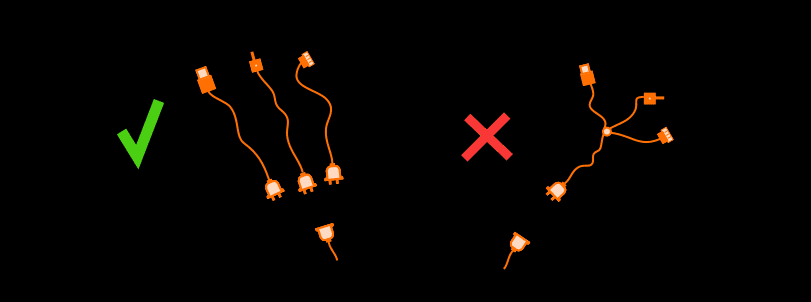
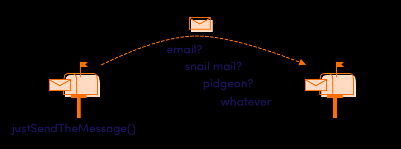

---
ebook:
  theme: github-light.css
  title: 객체지향
  authors: Escatrgot
  disable-font-rescaling: true
  margin: [0.1, 0.1, 0.1, 0.1]
---
<style>
    h3.quest { font-weight: bold; border: 3px solid; color: #A0F !important;}
    .quest { font-weight: bold; color: #A5F !important;}
    h2 { border-top: 12px solid #D40; border-left: 5px solid #D40; border-right: 5px solid #D40; background-color: #D40; color: #FFF !important; font-weight: bold;}
    h3 { border-top: 12px solid #F90; border: 5px solid #F90; background-color: #F90; color: #FFF !important;}
</style>

## 📕 4. 객체지향 디자인 패턴

#### 유니티에서 사용하면 좋을 디자인 패턴만 명시한다.

---
### 📄 1. 디자인패턴 개요
#### 1). 디자인패턴 왜 배우나? 
**통계적으로 발생되는 문제 23개 패턴 <br>읽기쉽게 이해하기쉽고 수정하기쉬운 코드로 만들기 위해**

#### 2). 종류
1. **생성** 패턴 : 5
2. **구조** 패턴 : 7
3. **행위** 패턴 : 11

#### 3). 아키텍쳐 패턴 VS 디자인 패턴
* **아키텍쳐 패턴** : 시스템 구조에 대한 가이드 라인 
  * 모듈 & 컴포넌트를 어떻게 배치할지
* **디자인 패턴** : 모듈의 세분화된 역활 & 보듈간의 인터페이스를 상세 구현할때 쓰는 가이드 라인

---

### 📄 2. SOLID Principle 
#### 1). SRP (Single Responsibility Principle)
<p align="center">
    
</p>

**ⓐ 단일 책임 원칙**
* 클만변
    1. 클래스 만들때
       * 걔는 단 하나의 책임을 가져야한다
    2. 클래스 변경할때
       * 걔는 단 한가지 이유가 있어야한다

* 높은 응집력과 낮은 결합

**ⓑ 예시**
* [SRP BAD 🤪](./src/SOLID/SRP_BAD.cs)
* [SRP GOOD 😎](./src/SOLID/SRP_GOOD.cs)
* [Python : SRP 비준수와 준수](./src/SOLID/SRP비준수준수.py)

#### 2). OCP (Open-Closed Principle) 

<p align="center">
    
</p>

**ⓐ 확장-폐쇠 원칙**

* 확변
    1. 확장시
       * 열려있어야함
    2. 변경시
       * 닫혀있어야함

**ⓑ 정확한 설명**

* 
    ```text
    1. 새로운 기능을 추가싶을때 있다.
    2. 그런데 추가 시킬때마다 만들었던 코드를 수정해야된다면
    3. 너무 불편하지 않겠나? (애초에 수정이라는 과정에서 버그가 발생하기 마련이다)
    4. 그러지말고 그냥 한줄만 추가해도 기능 확장이 쉬운 구조로 만들자는것
    ```

**ⓒ 예시**
* [OCP BAD 🤪](./src/SOLID/OCP_BAD.cs)
* [OCP 준수 😎](./src/SOLID/OCP_GOOD.cs)
* [Python : OCP 비준수 코드](./src/SOLID/OCP비준수.py)  : <br> Cow와 Sheep을 추가하기위해 hey함수의 수정이 필요하다.
* [Python : OCP 준수 코드](./src/SOLID/OCP준수.py) : <br> 추가되는 동물에 대해 hey함수의 수정을 필요로 하지 않는다

#### 3). LSP (리스코프 Substitute Principle) 
<p align="center">
    
</p>

**ⓐ 리스코프 치환 원칙**
* 상위 클래스가 하위 클래스로 치환될때 문제없이 잘 돌아가야한다.
  * we can use any inheriting class in place of the base class.

* **[LSP 예시](./src/SOLID/LSP준수비준수.py)**

#### 4). ISP (Interface Segregation Principle) ❓

<p align="center">
    
</p>

**ⓐ 인터페이스 분리 원칙**

커버져린 인터페이스 사용시 사용하지도 않을 인터페이스가 
클래스로 들어오게 된다면?..

* 뚱뚱한 인터페이스를 사용 해서는 안된다.
  * 클라이언트는 사용하지도 않을 메소드들에게
의존하게 해선 안된다 인터페이스를 더 작은 단위로 나누자
  * 
  * 
    ```text
    1. 자동차 인터페이스는 
         * 자동차 인터페이스 클래스만
    2. 보트 인터페이스는 
         *  보트 인터페이스 클래스만
    3. 만약 양육자동차려면
         * 자동차 보트 인터페이스 둘다 가져오기
    ```

**ⓑ 예시**
* **[Python : ISP 준수 비준수](./src/SOLID/ISP준수비준수.cs)**

#### 5). DIP (Dependency Inverse Principle) ❓

<p align="center">
    
</p>

**ⓐ 의존 역전 원칙**

* "추상화에 의존하라"
  * 자세한 구현보다는 추상화에 의존해야 합니다 . 

* 변동성이 큰 구체 클래스로부터 파생하지 말라. 추상 팩토리(Abstract Factory)를 사용하도록 강제한다.

* 특정 구현에 대한 종속성을 줄여야 하지만 인터페이스에 의존해야 합니다 . 

* 슈퍼클래스에서 디폴트 기능을 정의해두거나 비워뒀다가 서브클래스에서 선택적으로 오버라이드할 수 있도록 만들어둔 메소드를 훅(hook) 메소드라고 합니다. 
* 서브클래스에서는 추상 메소드를 구현하거나, 훅 메소드를 오버라이드하는 방법을 이용해 기능의 일부를 확장합니다.

**ⓑ 예시**
* [DIP_BAD 🤪](./src/SOLID/DIP_BAD.cs)
* [DIP_GOOD 😎](./src/SOLID/DIP_GOOD.cs)
* [Python : DIP_비준수](./src/SOLID/DIP비준수.py)
* [Python : DIP_준수](./src/SOLID/DIP준수.py)


### 📄 3. 생성 패턴

생성과 참조과정을 캡슐화 하여 객체가 생성되거나 변경되도
시스템에 영향을 크게 받지 않도록 프로그램의 유연성을 더해주는 패턴

#### 1). ✨ 싱글톤 ✨
* 하나의 객체를 생성하면 어디에서든지 참조 가능하지만 
여러 프로세스가 동시에 참조할 수 없음
* 클래스 내에서 인스턴스가 단 하나뿐임을 보장
불필요한 메모리 낭비 최소화
* 전역 변수를 사용하지 않고 객체를 하나만 생성하도록 하며, 생성된 객체를 어디에서든지 참조할 수 있도록 하는 패턴

### 📄 4. 구조 패턴

클래스나 객체를 조합하여 더 큰구조로 만드는 패턴

#### 1). 플라이 웨이트
* 인스턴스가 필요할 때마다 매번 생성하는것이 아닌 가능한 공유를 통해 사용함으로 메모리를 절약하는 패턴
* 다수의 유사객체를 사용하거나 조작할떄 유용

#### 2). 데코레이터
* 객체의 결합을 통해 기능을 동적으로 유연하게 확장할 수 있게 해주는 패턴
* 객체간 결합을 통해 능동적으로 기능들을 확장할 수 있는 패턴

* 임의의 객체에 부가적인 기능을 추가하기위해 다른 객체를 덧붙이는 방식으로 구현함

### 📄 5. 행동 패턴

클래스와 객체간 서로 상호작용하는 방법이나 책임 분배 방법을 정의
하나의 객체로 수행할 수 없는작업을 여러 객체로 분해하면서 결합도를 낮출수 있음

#### 1). ✨ Command ✨
* Express actions for actors as classes.
* 실행될 기능을 캡슐화함으로써 주어진 여러 기능을 실행할 수 있는 재사용성이 높은 클래스를 설계하는 패턴
* 요청을 객체 형태로 캡슐화 하여 재이용하거나 취소 할수 있도록 
필요 정보를 저장하거나 로그에 남기는 패턴
* 요청에 사용되는 명령어를 추상클래스나 구체 클래스로 분리하여 단순화 시킴

#### 2). ✨ Observer ✨
* An object, called the subject, maintains a list of its dependents, called observers, and notifies them automatically of any state changes.
* 한 객체의 상태 변화에 따라 다른 객체의 상태도 연동되도록 일대다 객체 의존 관계를 구성하는 패턴
* 한 객체의 상태가 변화하면 객체에 상속되어 있는 다른 객체들에게도 변화된 상태를 전달하는 패턴
* 주로 분산된 시스템간에 이벤트를 생성 발행하고 이를 수신해야할떄 이용함

#### 3). State
* 객체의 상태에 따라 객체의 행위 내용을 변경해주는 패턴
* 객체의 상태에 따라 동일한 동작을 다르게 처리해야할떄,
* 객체 상태를 캡슐화 하여 이를 참조하는 방식

### 📄 6. 그밖에 Unity에 유용한 패턴

#### 1). Subclass Sandbox
* Define behavior in a subclass using a set of operations provided by its base class.

#### 2). Event queue
* Decouple when a message or event is sent from when it is processed.

#### 3). ✨ Object Pool ✨
* Improve performance and memory use by reusing objects from a fixed pool instead of allocating and freeing them individually.

### 📄 6. 참고

1. [코드없는 프로그래밍 SOLID](https://www.youtube.com/watch?v=jlQkWM7Tu7o&list=PLDV-cCQnUlIZcWXE4PrxJx6U3qKfRTJcK&index=1)
2. https://github.com/accesto/solid-php
3. https://accesto.com/blog/solid-php-solid-principles-in-php/

4. https://korstrix.github.io/index/Index/
5. https://github.com/Habrador/Unity-Programming-Patterns
6. https://csharpindepth.com/articles/singleton