---
ebook:
  theme: github-light.css
  title: 객체지향
  authors: Escatrgot
  disable-font-rescaling: true
  margin: [0.1, 0.1, 0.1, 0.1]
---
<style>
    h3.quest { font-weight: bold; border: 3px solid; color: #A0F !important;}
    .quest { font-weight: bold; color: #A5F !important;}
    h2 { border-top: 12px solid #D40; border-left: 5px solid #D40; border-right: 5px solid #D40; background-color: #D40; color: #FFF !important; font-weight: bold;}
    h3 { border-top: 12px solid #F90; border: 5px solid #F90; background-color: #F90; color: #FFF !important;}
</style>

## 📕 4. 객체지향 디자인 패턴

#### 유니티에서 사용하면 좋을 디자인 패턴만 명시한다.

---

### 📄 0. 사전 지식

#### 1). 응집도와 결합도.
link : [응집도와 결합도](./응집도_결합도/응집도N결합도.md)

### 📄 1. 디자인패턴 개요
#### 1). 디자인패턴 왜 배우나? 
**통계적으로 발생되는 문제 23개 패턴 <br>읽기쉽게 이해하기쉽고 수정하기쉬운 코드로 만들기 위해**

#### 2). 종류 : 이것중 우리는 일부만 배운다. 
1. **생성** 패턴 : 5
2. **구조** 패턴 : 7
3. **행위** 패턴 : 11

#### 3). 아키텍쳐 패턴 VS 디자인 패턴
* **아키텍쳐 패턴** : 시스템 구조에 대한 가이드 라인 
  * 모듈 & 컴포넌트를 어떻게 배치할지
* **디자인 패턴** : 모듈의 세분화된 역활 & 보듈간의 인터페이스를 상세 구현할때 쓰는 가이드 라인

---

### 📄 2. SOLID Principle 
#### 1). SRP (Single Responsibility Principle)
<p align="center">
    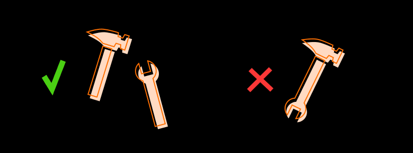
</p>

**ⓐ 단일 책임 원칙**
* 클만변
    1. 클래스 만들때
       * 걔는 단 하나의 책임을 가져야한다
    2. 클래스 변경할때
       * 걔는 단 한가지 이유가 있어야한다

* 높은 응집력과 낮은 결합

**ⓑ 예시**
* [SRP BAD 🤪](./src/SOLID/SRP_BAD.cs)
* [SRP GOOD 😎](./src/SOLID/SRP_GOOD.cs)
* [Python : SRP 비준수와 준수](./src/SOLID/SRP비준수준수.py)

#### 2). OCP (Open-Closed Principle) 

<p align="center">
    
</p>

**ⓐ 확장-폐쇠 원칙**

* 확변
    1. 확장시
       * 열려있어야함
    2. 변경시
       * 닫혀있어야함

**ⓑ 정확한 설명**

* 
    ```text
    1. 새로운 기능을 추가싶을때 있다.
    2. 그런데 추가 시킬때마다 만들었던 코드를 수정해야된다면
    3. 너무 불편하지 않겠나? (애초에 수정이라는 과정에서 버그가 발생하기 마련이다)
    4. 그러지말고 그냥 한줄만 추가해도 기능 확장이 쉬운 구조로 만들자는것
    ```

**ⓒ 예시**
* [OCP BAD 🤪](./src/SOLID/OCP_BAD.cs)
* [OCP 준수 😎](./src/SOLID/OCP_GOOD.cs)
* [Python : OCP 비준수 코드](./src/SOLID/OCP비준수.py)  : <br> Cow와 Sheep을 추가하기위해 hey함수의 수정이 필요하다.
* [Python : OCP 준수 코드](./src/SOLID/OCP준수.py) : <br> 추가되는 동물에 대해 hey함수의 수정을 필요로 하지 않는다

#### 3). LSP (리스코프 Substitute Principle) 
<p align="center">
    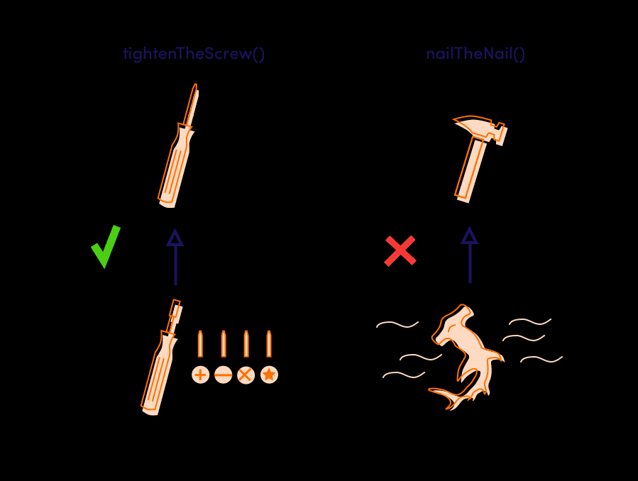
</p>

**ⓐ 리스코프 치환 원칙**
* 상위 클래스가 하위 클래스로 치환될때 문제없이 잘 돌아가야한다.
  * we can use any inheriting class in place of the base class.
* 자식 클래스가 부모클래스의 역할을 제대로 수행 못할때.

* 리스코프 치환이 잘못된 상황
  ```cs
  public class 망치 {
    void virtual 못을박기() {...}
    void virtual 공구상자에넣기(){...}
  }

  public class 귀상어_HammerheadShark : 망치(){
    void override 못을박기(){...}       //귀상어로 못을 박을수가 있나?
    void virtual 공구상자에넣기(){...}  //귀상어를 공구상자에 넣읗수 있나??
    //사용안할 메소드를 받는게 잘 된건가?
  }

  public class 목공 {
    public void 연결(못, 망치, 나무들){
      만약... 인수 타입이 "귀상어_HammerheadShark"라면?
      귀상어로 망치질 할수 있나?
    }
  }

  static void Main(String argv){
  }
  ```

* **[LSP 예시](./src/SOLID/LSP준수비준수.py)**

#### 4). ISP (Interface Segregation Principle) ❓

<p align="center">
    
</p>

**ⓐ 인터페이스 분리 원칙**

커버져린 인터페이스 사용시 사용하지도 않을 인터페이스가 
클래스로 들어오게 된다면?..

* 뚱뚱한 인터페이스를 사용 해서는 안된다.
  * 클라이언트는 사용하지도 않을 메소드들에게
의존하게 해선 안된다 인터페이스를 더 작은 단위로 나누자
  * 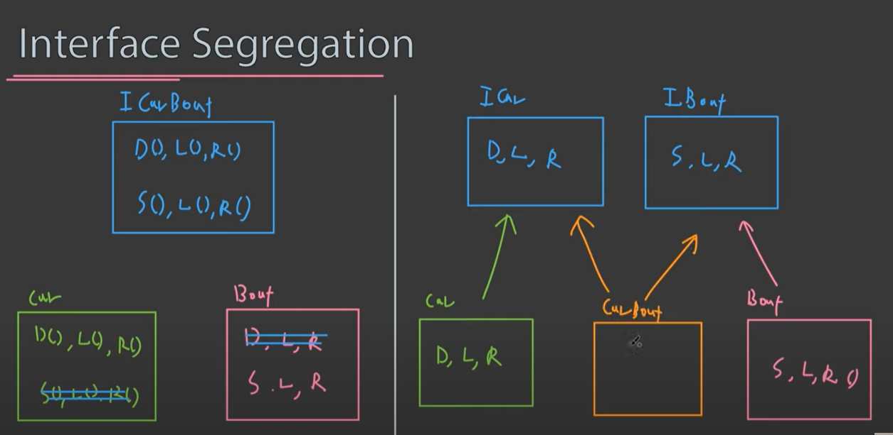
  * 
    ```text
    1. 자동차 인터페이스는 
         * 자동차 인터페이스 클래스만
    2. 보트 인터페이스는 
         *  보트 인터페이스 클래스만
    3. 만약 양육자동차려면
         * 자동차 보트 인터페이스 둘다 가져오기
    ```

**ⓑ 예시**
* **[Python : ISP 준수 비준수](./src/SOLID/ISP준수비준수.cs)**

#### 5). DIP (Dependency Inverse Principle) ❓

<p align="center">
    
    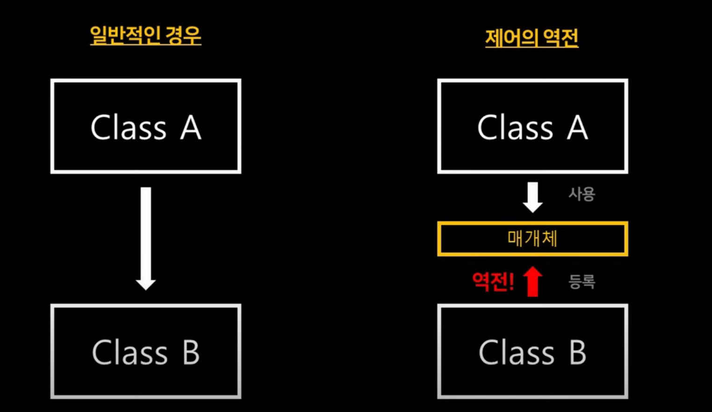
</p>

**ⓐ 의존 역전 원칙**

* "추상화에 의존하라"
  * 구체적인 개념보다는 추상적인 개념에 의존해야 한다.

* 변동성이 큰 클래스로부터 파생하지 말자, 대신 추상 팩토리로 파생하여 확장성을 높이자
* 서브클래스에서는 추상 메소드를 구현하거나, 훅 메소드를 오버라이드하는 방법을 이용해 기능의 일부를 확장합니다.

**ⓑ Hook 메소드 란?**
  1. *[1) Virtual 하게 정의]* 해두거나 *[2) 비워진 (추상적으로)]* 수퍼 클래스에 정의된 메소드이며,

* 특정 구현에 대한 종속성을 줄여야 하지만 인터페이스에 의존해야 합니다.

**ⓑ 예시**
* [DIP_BAD 🤪](./src/SOLID/DIP_BAD.cs)
* [DIP_GOOD 😎](./src/SOLID/DIP_GOOD.cs)
* [Python : DIP_비준수](./src/SOLID/DIP비준수.py)
* [Python : DIP_준수](./src/SOLID/DIP준수.py)

---

### 📄 3. 생성 패턴

<div align="center">
  <h4> 생성과 참조과정을 캡슐화 하여 객체가 생성되거나 변경되도 <br>
  시스템에 영향을 크게 받지 않도록 프로그램의 유연성을 더해주는 패턴</h4>
</div>

#### 1). Singleton pattern

<p align="center">
    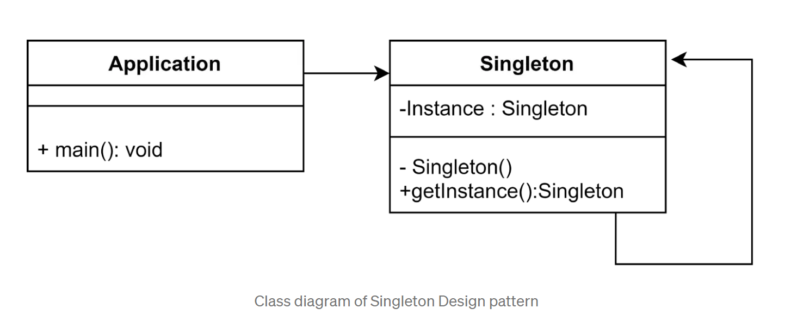
</p>


**ⓔ 구성요소**

1. **Application** : 싱글톤에 접근하는 어떠한 아~무 코드
1. **Singletion** : 
    * *private*로 싱글톤 인스턴스가 클래스 내부에 포함된다.
    * *GetInstance()* 로 싱글톤 인스턴스를 static으로 접근한다.

**ⓐ 특징**

1. 전역적으로 접근 가능한 객체라 어디에서든지 참조할 수 있다.
2. ***인스턴스가 오직 단 하나를 상성함을 보장***, 불필요한 메모리 낭비를 최소화 할 수 있다
3. 너무 남용하면 다른 클래스의 인스턴스들 간에 결합도가 높아져 개방 폐쇠 원칙이 위배될 수 있다.

**ⓑ 사용하는 이유**

* 전역적으로 사용되는 데이터, 리소스를 수시로 접근해야 할때

* GameManager 힘들게 지정하는 대신 쉽게 Static으로 접근 가능

**ⓒ 다음과 같은 목적에 사용하기를 권한다.**

```text
1. 환경설정 : Audio Manager
2. Save & Load : 단 동기화 문제가 없을시.
3. Camera : 이미 유니티에 Camera.main으로 구현되어있음
4. EventSystem : 사실 이미 유니티에 구현되어 있음
5. Pool : 싱글톤 GameObject를 생성해서 사용. 
  GameLoop가 없는 객체로만.
```

**ⓓ 사용해서는 안되는 상황**

```text
1. 플레이서, 몹, 이펙트
개발 과정에서 결합도가 높아지는 경우가 있음
게다가 Static 변수는 어디서 일어난 버그인지 디버깅 트랙하기 힘들다. 
```


**ⓕ 예시**

**1. 동시성 문제** : *하나만 있어야할 싱글톤 객체가 두번 생성될 수 있는 문제.*
* 싱글톤 생성이 느리면 모든 쓰레드가 거의 동시에 도착하고 이로인해 서로가 null 객체를 바라볼수 있다.
* ***해결책 : Thread-Safe 가 보장되어야 한다.***
* [Lazy 기법을 이용한 싱글톤](./src/Design/LazySingleton.cs)

**2. 프레임 드랍 문제** 
* 필요할 때 초기화하는 Lazy 기법. 하지만 전투 도중에 시스템 초기화 작업을 수행한다면 중간에 프레임이 떨어지거나 게임 화면이 뚝뚝 끊길 수도 있다. 
* ***해결책 : 게임 플레이에 영향이 미치지않도록 시작과 동시에 정적 변수를 초기화***
* [일반적인 싱글톤 & 오브젝트 풀](./src/Design/Singleton.cs)

---
### 📄 4. 구조 패턴


<div align="center">
  <h4>클래스나 객체를 조합하여 더 큰구조로 만드는 패턴 </h4>
</div>

#### 1). Composite Pattern

<p align="center">
  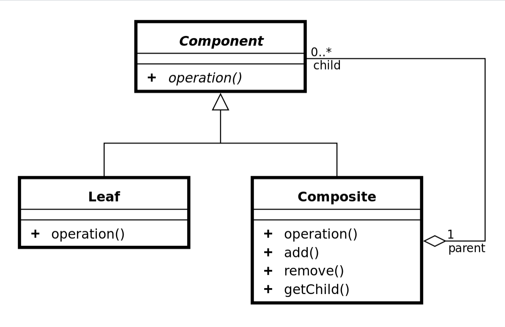
</p>

**ⓐ 쓰는 이유?**

1. 여러 개체를 동일한 목적으로 사용하고 있으며 각 개체를 처리하는 코드가 거의 동일한 경우 컴포지트를 사용하는 것은 좋은 선택이다.
2. 칼이면 휘두루고, 총이면 방아쇠를 당기는등. 컴포지트와 각기다른 객체의 차이를 무시하고 **어쨌든 공격한다는 점**에서 같은 동작처럼 사용하고 싶을때. <sub>*Composite should be used when clients ignore the difference between compositions of objects and individual objects*</sub>
3. 트리 계층 구조에서 상속이 가지는 문제를 해결해준다. part-whole hierarchies 
   * [😨 트리 구조에서 상속의 문제점 *(우리가 굳게 믿었던 상속이 사실 개 트롤일수도 있다..)* 😨](./IsA_HasA/상속의문제.md)

**ⓑ 구성요소**
|Case 1|Case 2|
|---|---|
||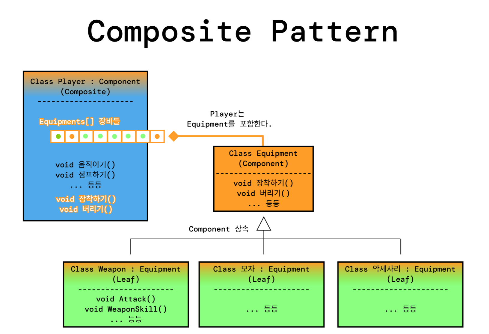|

1. **Component** : 추상클래스 또는 인터페이스다.
2. **Leaf** : *Leaf*는 *Component* 의 파생 클래스이다.
3. **Composite** : 다른건 몰라도... 다음이 포함된다.
    1. Component 인스턴스를 담는 컨테이너 (List, Dictionary)
        ```cs
        private List<Component> components = new List<Component>();
        ```
    2. Component 컨테이너를 추가하거나 삭제하는 매서드
        ```cs
        public addComponent(Component _c) {
          components.Add(_c);
        }
        ```

**ⓑ 예시**

* [Composite Pattern (C#)](./src/Design/Composite.cs)
* [Composite Pattern 2 (C#)](./src/Design/Composite2.cs)

#### 2). Decorator Patterns


<p align="center">
  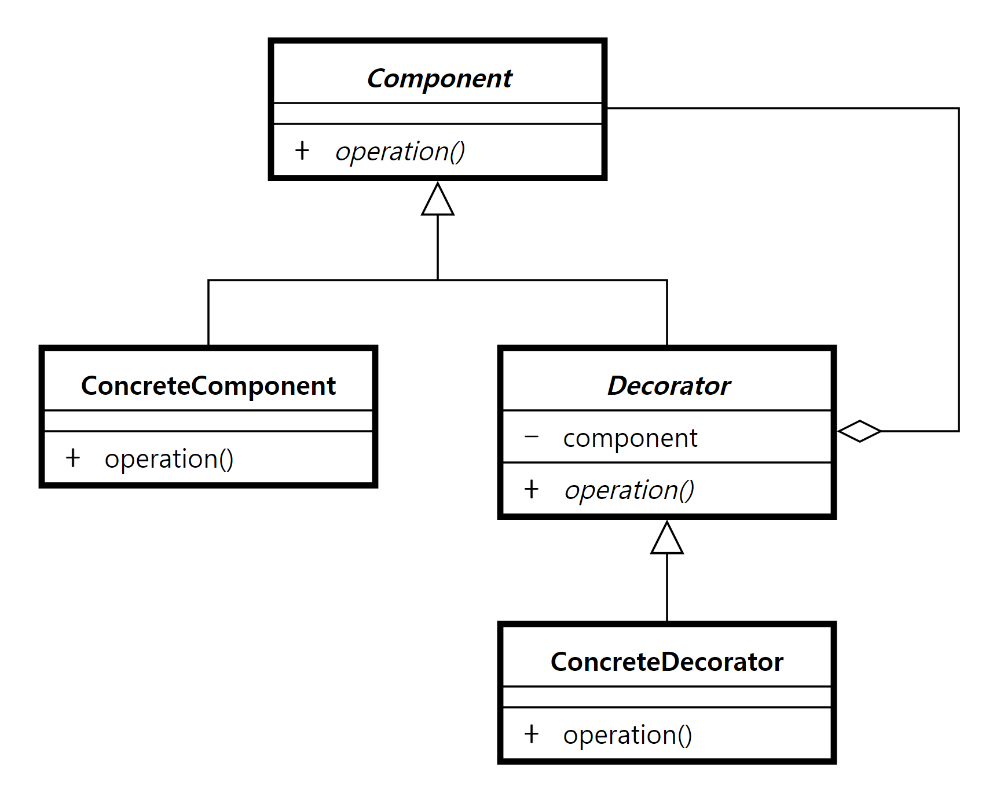
</p>

**ⓐ 특징**
* 객체의 기본 기능에 추가 기능을 덧붙여 결합 & 장착할 수 있다. 
* 즉 객체를 런타임 동안 동적으로 변화시킬수 있다.

**ⓑ 왜 쓰는가?**
* 기능 확장성
  * 기존 코드를 수정하지 않고도 데코레이터 패턴을 통해 행동을 확장할수 있다.
* 동적 확장성
  * 구성과 위임을 통해서 실행중에 새로운 행동을 추가할 수 있습니다.

**ⓒ 구성요소** 

1. **Component**
    * 인터페이스 또는 추상클래스가 된다.
    * 기본 기능을 정의한다.
2. **ConcreteComponent**
    * 기본 기능이 되는 인스턴스가 된다. 데코가 붙을 대상
    * *Component*를 상속한다.
3. **Decorator**
    * 데코가 붙을 대상을 포함한다. 
    * *ConcreteDecorator*의 form을 제공함 ConcreteDecorator가 생긴다면 다 Decorator와 비슷하게 생김
    * 추상클래스다
4. **ConcreteDecorator**
    * 객체에 *ConcreteDecorator*기능을 추가하고싶을때 
    *ConcreteDecorator* 생성자에 객체를 넣는다 그럼 행동이 추가된다.

**ⓓ 단점**
* 데코레이터를 너무 많이 사용하면 코드가 필요 이상으로 복잡해 질 수 도 있다.  

**ⓔ 예시**

* [Decorator Pattern (C#)](./src/Design/Decorator.cs)
* [Decorator Pattern 2 (C#)](./src/Design/Decorator2.cs)
* [Decorator Pattern 3 (C#)](./src/Design/Decorator3.cs)

#### 3). Flyweight Pattern

<p align="center">
  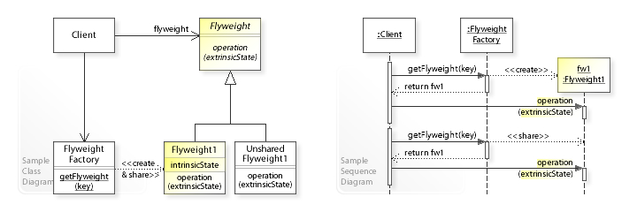
</p>

**ⓐ 특징**
* 다수의 유사객체를 사용하거나 조작할떄 유용
* 인스턴스가 필요할 때마다 매번 생성하는것이 아닌 가능한 공유를 통해 사용함으로 메모리를 절약하는 패턴
* 인스턴시에이트를 많이 해야할때, 공유를 통해 오브젝트를 더 가볍게, 메모리를 절약할때 사용한다.

**ⓑ 왜 쓰는건가?**
* 마인크래프트를 생각해보자 매~~~~~~우 많은 블럭들이 있을것이다. 이 마크에서는 텍스쳐를 플라이 웨이트방식으로 구현했다
* 만약 스타같은 게임을 만든다할때. 유닛들은 같은 mesh, texture, maxhelth setting등등
이 유닛들이 모두 단일 오브젝트를 받아 공유되게끔 만들수 있다.
* 유니티에서도 이미 sharedMesh, sharedMaterial으로 구현되어 있다. 하나 바꾸면 다 바뀌게

**ⓒ 구현**
* 모든 인스턴스에서 공유할 수 있는 데이터를 분할시킨다. 
* Storage 클래스를 만들어 공유데이터를 넣고, 불러오는 방식

---

### 📄 5. 행동 패턴

<h4 align="center">
클래스와 객체간 서로 상호작용하는 방법이나 책임 분배 방법을 정의
하나의 객체로 수행할 수 없는작업을 여러 객체로 분해하면서 결합도를 낮출수 있음
</h4>
 
#### 1). ✨ Command Pattern✨

<p align="center">
  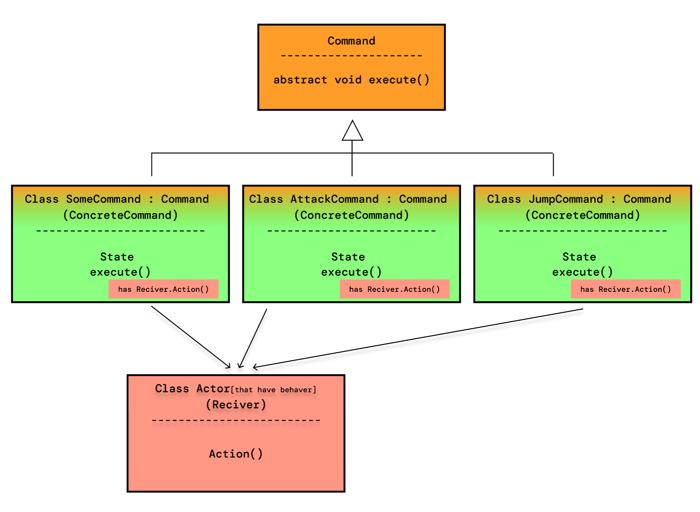
</p>

<p align="center">
  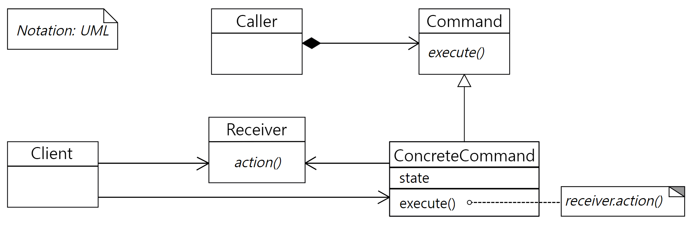
</p>

**ⓐ 특징**

* 커맨드 : **"함수를 추후에 불러낼(요청할)수 있는 형태"** 객체를 의미한다. 
  * 함수 이름, 함수를 보유하고 있는 객체, 그 함수에 사용될 인수 같은 정보를 가지고 
* ***"함수 호출(요청)"*** 를 인스턴스화 하는 패턴이다. 
  * 함수 호출을 객체로 감싼다는 것이므로 콜백을 객체지향적으로 표현한 것
* Invoke을 시킬 수 있고, 취소할 수 있다.

절차
1. Caller 인보커에 트리거가 들어가면
2. 트리거에 컴포넌트된 excute 함수를 실행시켜
3. excute 함수에 컴포넌트된 리시버 함수가 실행


**ⓑ 왜 쓰는건가?**

1. 커맨드를 이용해 캡슐화 하여 재사용성이 높은 클래스설계할 수 있다.

2. 리플레이 시스템
    * 각 업데이트마다 했던 호출된 함수(매서드) 로그를 남긴다.
    * 그 커맨드(함수호출)들은 이터레이트 가능
    * undo와 redo 시스템을 구현할 수 있다.
3. 입력 키 변경

**ⓒ 구성요소**
* **Command** : 
  * 적어도 ConcreteCommand면 가져야할 것을 정의하는 상위클래스
  * execute(actor) 함수를 가지는 **인터페이스 || 추상클래스**
* **ConcreteCommand** : 클래스명은 행동에대한 동사형 적기 (Ex. TurnTvOn, JumpCommand) 
  * 이제 *행동 A호출*이라는것을 구현한 클래스이다.
  * Command에서 파생됨
  * 리시버를 포함하고 리시버의 매소드를 사용한다., 생성자를 받아 Receiver을 초기화해주자.
  * 커맨드가 어떻냐 조건에 따라 호출할 행동을 작성
* **Receiver** :
  * 행동 A에 대한 로직을 가지고 있다.
  * 행동 A는 커맨드에서 사용된다.
* **Caller || Invoker** :
  * 선택적으로 커맨드 execution을 보류할 수 있고,
  * 커맨드실행을 한다.


**ⓓ 예시**
* [Command Pattern 정석적인 예시 (C#)](./src/Design/Command2.cs)
* [Undo Command (C#)](./src/Design/Command.cs)
* [Command Pattern 키 변경 (C#)](./src/Design/Command3.cs)

**ⓔ 참고**
* 명령 패턴을 쓰다보면 수많은 Command 클래스를 만들어야 할 수 있다. 이럴 때에는 상위 클래스에 여려 가지 편의를 제공하는 상위 레벨 메서드를 만들어 놓은 뒤에 필요하면 하위 클래스에서 원하는 작동을 재정의할 수 있게 하면 좋다. 이러면 명령 클래스의 execute 메서드가 하위 클래스 샌드박스 패턴으로 발전하게 된다.

#### 2). ✨ Observer Pattern✨

<p align="center">
  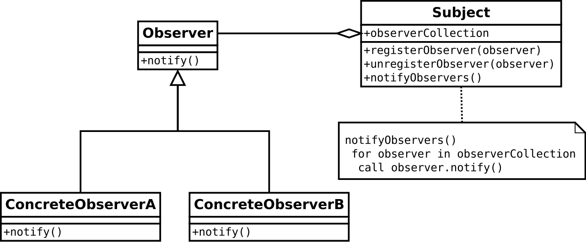
</p>

<h4 align="center">✨매우 중요하므로 대리자 & 이벤트 에서 정리✨</h4>

**ⓐ 특징**
* 이벤트기반 패턴이다. 디커플링에 매우 유용  

**ⓑ Unity also has its own implementation.** 
1. EventHandler 2. Action 3. UnityEvent 4. delegate


#### 3). State Pattern

<p align="center">
  
</p>

<p align="center">
  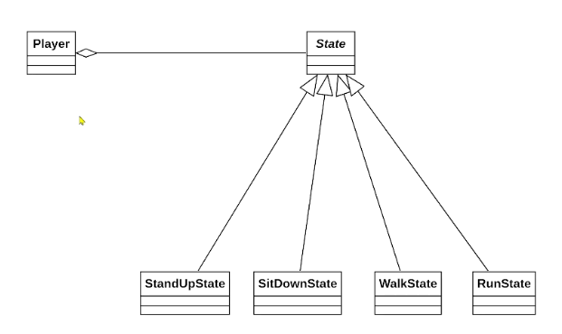
</p>

**ⓐ 특징**

* "상태"를 객체화한 패턴이다. 이 상태라는것도 참조가능하다.
* 상태에 따라 객체의 행위 내용을 변경해주는 패턴
  * 메인 캐릭터가 가질만한 상태를 생각해보자. jump, walk, run 등등..
이러한 상태를 손쉽게 switcing 하고 싶을떄. 제안하는 패턴이다.
* 오토마타의 state machine와 관련이 깊다.
  * [FSM 유한상태기계의 기초 & 유니티 설계 이론.](../..//Math/FSM.md)

**ⓑ 왜 쓰는가?**

* if 조건절이 많을때 사용하면 유용하다.
* 객체의 상태에 따라 동일한 동작을 다르게 처리해야할떄,
  * 메인메뉴, 미니게임, 인트로 영상 등등을 구현하는데 좋다.
  * 적 AI만드는데 좋다.
* 실제 유니티의 animatior에 구현이 되어있다.

**ⓒ 구성요소**
* **State** : 
  * 상태 전이를 시키는 ***상태전이 함수(handle)*** 를 추상화하여 ConcreateState가 파생되도록
* **ConcreateState** 
  * State를 상속받고, ***상태전이 함수(handle)*** 를 구체화 한다.
  * 그리고 이 객체 자체가 ***상태*** 가된다.
* **Context || Player**
  * Player는 State 객체를 포함하고 있다.
  * player.state = new ConcreateState()를 통해
  * ***상태 (ConcreateState)*** 로 전이한다.


**ⓓ 예시**
* [신호등 State (C#)](./src/Design/State.cs)
* [서있기, 앉기, 걷기, 달리기 (C#)](./src/Design/State2.cs)


https://ozt88.tistory.com/8

---

### 📄 6. 그밖에 Unity에 유용한 패턴

#### 1). ✨ Subclass Sandbox ✨ : Behavioral Patterns

<p align="center">
  
  <h4>상위 클래스가 제공하는 기능들을 통해서 하위 클래스에서 행동을 정의한다.</h4>
</p>


**ⓐ 특징**

\# abstract & override #protected #subclass

1. 실제 구현부, 메인이 되는 객체가 파생클래스다.
2. 그럼 상위클래스가 제공하는것은 뭔가? 
   * 상위 클래스는 하위 클래스가 필요로 하는 기능을 전부 제공할 수 있다.
   * 상위 클래스는 하위 클래스용 메소드인 **Sandbox 메소드**를 제공한다.

3. ***sandbox*** 가 의미하는것.
    * 추상 원시 메소드.
    * protected로 만들어져 하위 클래스용이라는 걸 분명히 한다.
    * 하위 클래스에서 구현할때 아무 코드나 넣으면서 마음대로 구현할 수 있다.

**ⓑ 왜 쓰는건가?**

\# decouping #재사용성

***샌드박스 패턴은 이럴 때 좋다. :***

1. 클래스 하나를 잡고 많이 상속해야할때.
   * 유사한 클래스들을 파생클래스로 구현해야할때
2. 하위 클래스 한번 훑는데 어? 은근 기능 겹치는게 많음, 
겹치는 기능을 상위 클래스로 올려보내
하위 클래스끼리 쉽게 공유하고 싶을때. 
그럼으로 상위클래스는 하위클래스가 수행해야할 동작을 전부 제공한다.

1. 외부 코드간 커플링 감소
커플링을 상위 클래스에 몰아 놓아 하위 클래스가 필요로 하는 모든 기능을 상위 클래스에서 제공한다. 
   * 하위 클래스는 상위 클래스와만 커플링 될 뿐, 그 외 외부 시스템에는 전혀 접근하지 않는다.
   * 즉, 상위 클래스 외 다른 잡다한 외부 코드를 끌어들일 필요가 없다는 얘기 오직 소통해도 상위 클래스로만 소통한다

**ⓒ 주의 사항**
컴포지트 패턴에서 지적한 상속의 문제
1. 상위 클래스에 코드가 계속 쌓이는 경향이 있다. 특히 하위 클래스 샌드박스 패턴에서는 그럴 여지가 많다.

2. '깨지기 쉬운 상위 클래스' 문제

**ⓒ 구현**
1. [메서드를 직접 제공](./src/Design/SubclassSandbox.cs)
2. [컴포넌트 객체를 통해서 제공](./src/Design/SubclassSandbox2.cs)
3. [서브클래스 샌드박스로 몬스터 구현](./src/Design/SubclassSandbox/Monster.md)
#### 2). Event queue : Decoupling Patterns
* Decouple when a message or event is sent from when it is processed.

#### 3). ✨ Object Pool ✨ : Optimization Patterns
* Improve performance and memory use by reusing objects from a fixed pool instead of allocating and freeing them individually.
* 이 패턴은 매우 인기가 있어 Unity는 ObjectPool으로 사용가능하다.

---

### 📄 6. 참고

1. [코드없는 프로그래밍 SOLID](https://www.youtube.com/watch?v=jlQkWM7Tu7o&list=PLDV-cCQnUlIZcWXE4PrxJx6U3qKfRTJcK&index=1)
2. https://github.com/accesto/solid-php
3. https://accesto.com/blog/solid-php-solid-principles-in-php/

4. https://korstrix.github.io/index/Index/
5. https://github.com/Habrador/Unity-Programming-Patterns
6. https://csharpindepth.com/articles/singleton
7. https://gameprogrammingpatterns.com/contents.html

[싱글톤 개요](https://cjw-awdsd.tistory.com/42)
[싱글톤 c#](http://egloos.zum.com/sweeper/v/3157853)
[싱글톤 c#](https://nochoco-lee.tistory.com/676)
[Master Singleton: in unity the right way](https://gamedevbeginner.com/singletons-in-unity-the-right-way/)
[Master Singleton Video](https://www.youtube.com/watch?v=tcatvGLvCDc)
[컴포 패턴](https://www.youtube.com/watch?v=XXvrHAsfTso)
[컴포 패턴](https://8iggy.tistory.com/238)
[컴포 패턴](https://en.wikipedia.org/wiki/Composite_pattern)
[샌드박스](https://teamalphaaleph.wordpress.com/2016/03/03/subclass-sandbox-an-introduction/)
데코레이터
[서브클래스 샌드박스](https://lipcoder.tistory.com/140)
[서브클래스 샌드박스](https://teamalphaaleph.wordpress.com/2016/03/03/subclass-sandbox-an-introduction/)
[서브클래스 샌드박스](https://www.habrador.com/tutorials/programming-patterns/11-subclass-sandbox-pattern/)
[서브클래스 샌드박스](https://teamalphaaleph.wordpress.com/2016/03/03/subclass-sandbox-an-introduction/)
[커맨드 패턴](https://www.youtube.com/watch?v=bUULgkwaicQ)
[커맨드 패턴](https://www.youtube.com/watch?v=7Pj5kAhVBlg)
[상태 패턴](https://www.youtube.com/watch?v=XNwAfxaqWEc)
[상태 패턴](https://www.youtube.com/watch?v=MGEx35FjBuo)
[FSM](https://boycoding.tistory.com/262)
[FSM](https://www.youtube.com/watch?v=O_NJaHpbjaI)
[FSM](https://www.youtube.com/watch?v=MowE3moQ_Cw)