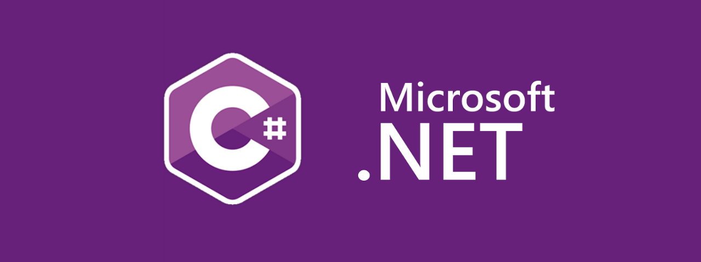

<h1 align="center"> 유니티 개발을 위한 C# 지식 </h1>

    

---

## 개요

<h3 align="center">오직 C# 기초를 다루는 노트입니다.</h3>

### 목차 

1. #### [객체 지향 프로그래밍](./OOP/README.md)
   * 객체지향 기본과 문법
   * 디자인 패턴
   * UML 다이어그램
2. #### [대리자 & 이벤트](https://learn.microsoft.com/ko-kr/dotnet/csharp/delegates-overview)
   * 델리게이트
   * 이벤트 지향 아키텍쳐 (Event Driven Architecture)

3. #### [비동기 프로그래밍](https://learn.microsoft.com/ko-kr/dotnet/csharp/programming-guide/concepts/async/)
   * async
   * 코루틴

4. #### [C# 기본]()
   * 자료구조, 타입
   * 연산자.
